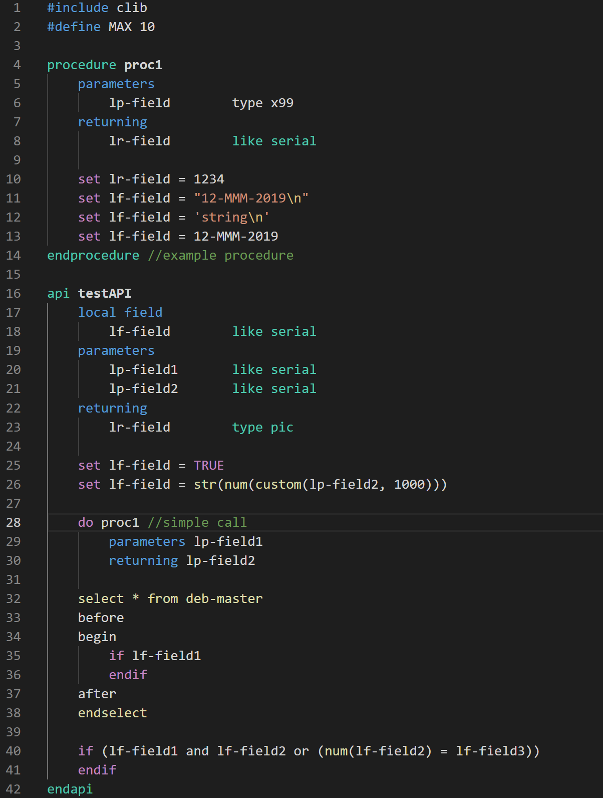

# pronto-4gl-language-definition README

This is an extension that provides syntax highlighting to 4GL scripts for [Pronto Xi ERP](https://www.pronto.net/products/pronto-xi-erp/). 

4GL scripts enables developers to extend or generate applications within Pronto Xi.

---

## Features

#### Syntax highlights :camera:

#### Code snippets
|Description|Snippet|
|-----------|-------|
|Select from|<pre>select fields from table  before detail after end-select</pre>|
|||

---

## Requirements

:bulb: Your 4GL scripts must be named with the `.spl` extension.

## Extension Settings

There are currently no extension settings.

## Release Notes

### `1.0.0`

Initial release :beginner:
